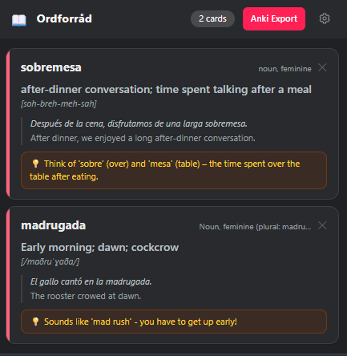
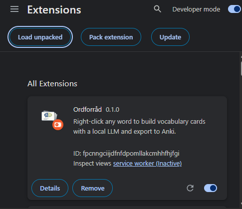
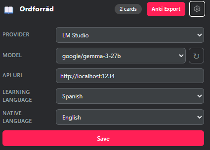
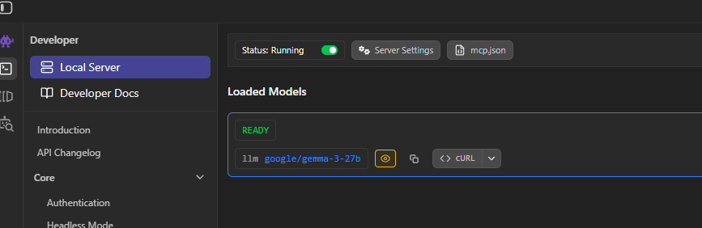
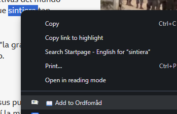

# Ordforråd

A Chrome extension for building vocabulary cards with an LLM and exporting them to Anki.

I've been using Anki for years. Back when I was still working through textbooks, making cards by hand was fine. You're already in learning mode, so switching to Anki and back doesn't feel like an interruption.

Reading native content online is different. You want to capture the words, but every time you stop to create a card you lose your place in the text. The overhead per word is just too high.

So I built this. Right-click any word on any page and a complete card comes back: translation, pronunciation, grammar notes, an example sentence in context, a memory tip. When you have enough cards, export to Anki and start reviewing.

---

## What you need

- Chrome (or any Chromium browser)
- One of:
  - **[LM Studio](https://lmstudio.ai)** running locally (free, no API key)
  - An **OpenAI** API key
  - An **Anthropic** API key

---

## Installation

1. Download or clone this repository.
2. Run `npm install && npm run build` to generate the CSS.
3. Open `chrome://extensions`, enable **Developer mode**, click **Load unpacked**, and select the project folder.

---

## Setup

Open the popup (click the extension icon), then click **⚙** in the top-right corner.

### LM Studio

Select **LM Studio** as the provider and enter the base URL of your running server (default: `http://localhost:1234`). Click **↻** to load available models, pick one, and save.

### OpenAI

Select **OpenAI**, paste your API key, and click **↻** to fetch the available models. The list is pre-filtered to chat-capable models.

### Claude (Anthropic)

Select **Claude**, paste your API key, and click **↻**.

---

## Usage

1. Select a word (or short phrase) on any webpage.
2. Right-click and choose **Add to Ordforråd**.
3. The extension calls the LLM in the background. A notification appears when the card is ready.
4. Open the popup to review the card.

---

## Export to Anki

Open the popup and click **Anki-Export**. This downloads an `.apkg` file you can import directly into Anki via *File → Import*.

Each card contains: word, translation, pronunciation, word class, grammar note, example sentence, and a memory tip.

---

## Languages

Configure the **learning language** and your **native language** in the settings panel. All 22 supported languages work in both slots.

The LLM prompt adapts automatically, no language-specific templates.

---

## Contributing

Pull requests are welcome.

## Libraries

[sql.js](https://github.com/sql-js/sql.js) and [JSZip](https://stuk.github.io/jszip/) are fetched from jsDelivr on first install and cached locally. No requests are made to any CDN after that.
